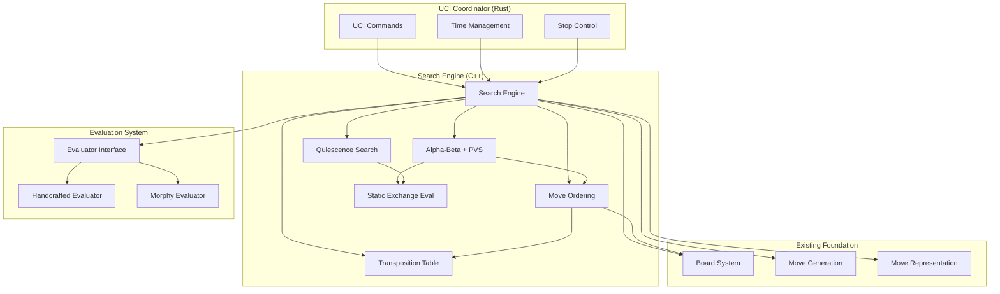

# Search & Evaluation System Design Document

## Overview

This document provides the technical design for implementing the core search and evaluation system for the Opera chess engine. The system builds upon the existing complete foundation (Board, MoveGen, UCI FFI bridge) to deliver competitive chess playing strength with Paul Morphy's aggressive, sacrificial style through advanced search algorithms and specialized evaluation functions.

## Architecture

### High-Level System Architecture



### Technology Stack

**Core Technologies:**
- **C++17**: Modern C++ with template optimizations and RAII
- **Existing Foundation**: Board (bitboards), MoveGen (all pieces), MoveGenList (32-bit packed)
- **UCI Integration**: FFI-compatible through existing UCIBridge.h interface
- **Testing**: Google Test framework (171/171 existing tests passing)

**Design Patterns:**
- **Strategy Pattern**: Evaluator interface allowing future neural network integration
- **Template Metaprogramming**: Compile-time optimization for critical path operations
- **RAII**: Automatic resource management for transposition tables and search state
- **Atomic Operations**: Thread-safe coordination with Rust UCI layer

## Component Design

### 1. Search Engine Coordinator

The `SearchEngine` class serves as the main coordinator, managing search parameters, time limits, and coordinating between search algorithms and evaluation.

```cpp
class SearchEngine {
private:
    Board& board;                         // Reference to existing board
    MoveGenList legal_moves;              // Reuse existing move generation
    TranspositionTable tt;                // Position cache
    std::unique_ptr<Evaluator> evaluator; // Pluggable evaluation
    std::atomic<bool>& stop_flag;         // UCI async coordination
    
    // Search state
    SearchLimits limits;
    SearchInfo current_info;
    std::array<Move, MAX_DEPTH> pv_line;
    
public:
    SearchEngine(Board& b, std::atomic<bool>& stop);
    
    SearchResult search(const SearchLimits& limits);
    void stop();
    bool is_searching() const;
    
private:
    SearchResult iterative_deepening();
    int aspiration_search(int depth, int prev_score);
    void update_search_info(int depth, int score, uint64_t nodes);
};
```

**Key Features:**
- **Iterative Deepening**: Progressive depth increase with complete depth guarantee
- **Aspiration Windows**: Narrow alpha-beta windows based on previous iteration scores
- **UCI Integration**: Atomic stop flag for responsive command handling
- **Progress Reporting**: Regular search info updates every 100ms

### 2. Alpha-Beta Search with Principal Variation Search

The core search algorithm implementing alpha-beta pruning with PVS optimization for maximum efficiency.

```cpp
class AlphaBetaSearch {
private:
    Board& board;
    TranspositionTable& tt;
    MoveOrdering& move_ordering;
    Evaluator& evaluator;
    std::atomic<bool>& stop_flag;
    
    // Search statistics
    uint64_t nodes_searched;
    std::array<Move, MAX_DEPTH> killer_moves;
    HistoryTable history;
    
public:
    struct SearchResult {
        Move best_move;
        int score;
        int depth;
        std::vector<Move> principal_variation;
        uint64_t nodes;
    };
    
    int search(int depth, int alpha, int beta, bool is_pv_node = true);
    
private:
    int pvs_search(int depth, int alpha, int beta, bool is_pv_node);
    int quiescence_search(int alpha, int beta);
    
    bool apply_pruning(int depth, int alpha, int beta, bool is_pv_node);
    int calculate_reduction(Move move, int depth, int move_count, bool is_pv_node);
    bool should_extend(Move move, bool in_check);
    
    void update_killer_moves(Move move, int depth);
    void update_history(Move move, int depth);
};
```

**Algorithm Features:**
- **Principal Variation Search**: Full window for PV nodes, null window for others
- **Late Move Reductions**: Reduce depth for moves ordered later in the list
- **Null Move Pruning**: Skip turn to detect positions where side to move has advantage
- **Futility Pruning**: Skip moves that cannot improve alpha in leaf nodes

### 3. Quiescence Search

Resolves tactical sequences to avoid horizon effects by searching only forcing moves.

```cpp
class QuiescenceSearch {
private:
    Board& board;
    Evaluator& evaluator;
    StaticExchangeEvaluator& see;
    
public:
    int search(int alpha, int beta, int depth = 0);
    
private:
    bool is_quiet_position() const;
    void generate_tactical_moves(MoveGenList& moves);
    bool is_good_capture(Move move) const;
    int delta_pruning_margin(int alpha) const;
};
```

**Features:**
- **Stand-Pat Evaluation**: Use static evaluation as lower bound
- **Capture-Only Search**: Only search captures, promotions, check evasions
- **Delta Pruning**: Prune captures that cannot improve position significantly
- **SEE Integration**: Use Static Exchange Evaluation to assess capture quality

### 4. Transposition Table

Clustered hash table using Zobrist keys for position caching with advanced replacement strategy.

```cpp
struct TTEntry {
    uint64_t zobrist_key;
    Move best_move;
    int16_t score;
    uint8_t depth;
    uint8_t flags;      // EXACT, LOWER_BOUND, UPPER_BOUND
    uint16_t age;       // For replacement strategy
};

class TranspositionTable {
private:
    static constexpr size_t CLUSTER_SIZE = 4;
    static constexpr uint64_t DEFAULT_SIZE_MB = 64;
    
    struct TTCluster {
        std::array<TTEntry, CLUSTER_SIZE> entries;
    };
    
    std::vector<TTCluster> table;
    size_t size_mask;
    uint16_t current_age;
    
public:
    TranspositionTable(size_t size_mb = DEFAULT_SIZE_MB);
    
    bool probe(uint64_t zobrist_key, TTEntry& entry) const;
    void store(uint64_t zobrist_key, Move best_move, int score, 
               int depth, int flags);
    
    void clear();
    void age_increment();
    double hit_rate() const;
    
private:
    size_t get_index(uint64_t zobrist_key) const;
    TTEntry& select_replacement_entry(TTCluster& cluster, uint8_t depth);
};
```

**Features:**
- **Clustered Design**: 4 entries per cluster for improved hit rates
- **Replace-by-Depth/Age**: Prefer replacing shallow/old entries
- **Zobrist Integration**: Uses existing board Zobrist keys
- **Memory Configurable**: UCI option for hash table size (16MB-2GB)

### 5. Move Ordering System

Multi-stage move prioritization crucial for alpha-beta efficiency, targeting >40% best-move-first rate.

```cpp
class MoveOrdering {
private:
    TranspositionTable& tt;
    StaticExchangeEvaluator& see;
    HistoryTable history;
    std::array<std::array<Move, 2>, MAX_DEPTH> killer_moves;
    
    // Move scoring constants
    static constexpr int TT_MOVE_SCORE = 10000;
    static constexpr int GOOD_CAPTURE_BASE = 8000;
    static constexpr int KILLER_MOVE_SCORE = 6000;
    static constexpr int HISTORY_MOVE_BASE = 1000;
    
public:
    void score_moves(MoveGenList& moves, const TTEntry* tt_entry, 
                     int depth, int ply);
    
    static void sort_moves(MoveGenList& moves);
    
    void update_killers(Move move, int depth);
    void update_history(Move move, int depth, bool good);
    
private:
    int score_move(Move move, const TTEntry* tt_entry, int depth, int ply);
    int mvv_lva_score(Move move) const;
};
```

**Scoring Priority:**
1. **Transposition Table Move**: Highest priority (10000 points)
2. **Good Captures**: MVV-LVA + SEE validation (8000+ points)
3. **Killer Moves**: Non-captures that caused cutoffs (6000 points)
4. **History Heuristic**: Moves successful in similar positions (1000+ points)
5. **Other Moves**: Remaining legal moves (0 points)

### 6. Static Exchange Evaluation

Evaluates capture sequences to determine if captures are beneficial, essential for accurate move ordering.

```cpp
class StaticExchangeEvaluator {
private:
    static constexpr std::array<int, 7> PIECE_VALUES = {
        0, 100, 320, 330, 500, 900, 10000  // Empty, Pawn, Knight, Bishop, Rook, Queen, King
    };
    
public:
    int evaluate(const Board& board, Move capture_move);
    bool is_good_capture(const Board& board, Move capture_move);
    
private:
    std::vector<int> get_attackers(const Board& board, Square square, Color side);
    int get_least_valuable_attacker(const std::vector<int>& attackers);
};
```

**Algorithm:**
- **Capture Sequence Simulation**: Play out all possible captures on target square
- **Minimax Evaluation**: Assume both sides play optimally in capture sequence
- **Early Termination**: Stop when one side clearly wins material
- **Integration**: Used by move ordering and quiescence search

### 7. Evaluation System

#### Abstract Evaluator Interface

Strategy pattern enabling future neural network integration while maintaining current handcrafted approach.

```cpp
class Evaluator {
public:
    virtual ~Evaluator() = default;
    
    virtual int evaluate(const Board& board, Color side_to_move) = 0;
    virtual void configure_options(const std::map<std::string, std::string>& options) = 0;
    
    // Optional incremental evaluation hooks
    virtual void on_move_made(Move move) {}
    virtual void on_move_undone(Move move) {}
    virtual void on_position_reset() {}
};
```

#### Handcrafted Evaluator Implementation

Traditional chess evaluation covering all major positional factors.

```cpp
class HandcraftedEvaluator : public Evaluator {
private:
    // Evaluation weights
    struct EvalWeights {
        int material[7] = {0, 100, 320, 330, 500, 900, 0};
        int mobility_weight = 4;
        int king_safety_weight = 20;
        int pawn_structure_weight = 10;
        int development_weight = 15;
    };
    
    EvalWeights weights;
    
public:
    int evaluate(const Board& board, Color side_to_move) override;
    void configure_options(const std::map<std::string, std::string>& options) override;
    
private:
    int evaluate_material(const Board& board, Color color);
    int evaluate_mobility(const Board& board, Color color);
    int evaluate_king_safety(const Board& board, Color color);
    int evaluate_pawn_structure(const Board& board, Color color);
    int evaluate_development(const Board& board, Color color);
    
    int piece_square_table_score(const Board& board, Color color);
    bool is_opening_phase(const Board& board);
    bool is_endgame_phase(const Board& board);
    int interpolate_phase_score(int opening_score, int endgame_score, int phase);
};
```

#### Morphy Evaluator Specialization

Specialized evaluator implementing Paul Morphy's sacrificial, development-focused style.

```cpp
class MorphyEvaluator : public HandcraftedEvaluator {
private:
    // Morphy-specific bias configuration
    struct MorphyBias {
        float development_bonus = 1.2f;           // Opening development emphasis
        float king_safety_aggression = 1.5f;      // Aggressive king attack weight
        float initiative_tempo_bonus = 1.1f;      // Active piece positioning
        int material_sacrifice_threshold = 100;   // Compensation for sacrifices
        int uncastled_king_penalty = 50;         // Safety-first principle
        float bias_multiplier = 1.0f;            // UCI configurable (0.0-2.0)
    };
    
    MorphyBias morphy_config;
    
public:
    int evaluate(const Board& board, Color side_to_move) override;
    void configure_options(const std::map<std::string, std::string>& options) override;
    
private:
    int apply_morphy_bias(int base_score, const Board& board, Color color);
    int evaluate_sacrifice_compensation(const Board& board, Color color);
    int evaluate_king_attack_potential(const Board& board, Color color);
    int evaluate_piece_activity(const Board& board, Color color);
    bool is_sacrificial_position(const Board& board, Color color);
    
    // Morphy-specific evaluation terms
    int development_bonus(const Board& board, Color color);
    int king_attack_bonus(const Board& board, Color color);
    int initiative_bonus(const Board& board, Color color);
    int castling_safety_penalty(const Board& board, Color color);
};
```

**Morphy Style Implementation:**
- **Development Priority**: 1.2x weight for piece development in opening
- **King Attack Focus**: 1.5x weight for positions attacking opponent's king
- **Sacrifice Recognition**: Up to 100cp compensation for material sacrifices with initiative
- **Tempo Emphasis**: 1.1x bonus for active, well-coordinated pieces
- **Safety Balance**: 50cp penalty for uncastled king (safety foundation)

## Data Structures and Algorithms

### Search Tree Management

```cpp
struct SearchNode {
    Board position;           // Position state
    Move move_played;         // Move that led to this position
    int depth_remaining;      // Remaining search depth
    int alpha, beta;          // Alpha-beta window
    bool is_pv_node;         // Principal variation node
    
    // Node statistics
    uint64_t nodes_searched;
    int best_score;
    Move best_move;
};
```

### Time Management Integration

```cpp
struct SearchLimits {
    int max_depth = MAX_DEPTH;
    uint64_t max_nodes = UINT64_MAX;
    uint64_t max_time_ms = UINT64_MAX;
    bool infinite = false;
    std::atomic<bool>* stop_flag = nullptr;
    
    bool should_stop(int current_depth, uint64_t nodes, uint64_t elapsed_ms) const;
};
```

### Performance Optimization

**Critical Path Optimizations:**
- **Inline Functions**: All performance-critical methods marked inline
- **Template Specialization**: Compile-time optimization for common scenarios
- **Memory Locality**: Data structures organized for cache efficiency
- **Branch Prediction**: Likely/unlikely hints for conditional statements

**Memory Management:**
- **Stack Allocation**: Search stack and move lists use stack memory
- **Pool Allocation**: Reuse search node objects to avoid heap allocation
- **TT Clustering**: Improve cache hit rates with spatial locality

## Integration with Existing Systems

### Board System Integration

```cpp
// Leverage existing board capabilities
class SearchBoardInterface {
public:
    static void generate_legal_moves(const Board& board, MoveGenList& moves) {
        // Use existing MoveGenerator functions
        generateAllMoves(board, moves);
    }
    
    static bool is_square_attacked(const Board& board, Square sq, Color by_color) {
        return board.isSquareAttacked(sq, by_color);
    }
    
    static bool is_in_check(const Board& board, Color color) {
        Square king_sq = board.findKing(color);
        return board.isSquareAttacked(king_sq, flip_color(color));
    }
};
```

### UCI FFI Bridge Integration

```cpp
// Implement existing UCIBridge.h interface
extern "C" {
    std::unique_ptr<opera::Search> create_search() {
        return std::make_unique<SearchEngine>(/* parameters */);
    }
    
    bool search_start(opera::Search& search, const opera::Board& board, 
                      int32_t depth, uint64_t time_ms) {
        SearchLimits limits;
        limits.max_depth = depth;
        limits.max_time_ms = time_ms;
        
        auto result = search.search(limits);
        return result.best_move != NULL_MOVE;
    }
    
    void search_stop(opera::Search& search) {
        search.stop();
    }
    
    rust::String search_get_best_move(const opera::Search& search) {
        return search.getBestMove();
    }
}
```

### Testing Integration

```cpp
// Extend existing GoogleTest framework
class SearchEvalTest : public ::testing::Test {
protected:
    void SetUp() override {
        board = std::make_unique<Board>();
        search_engine = std::make_unique<SearchEngine>(*board, stop_flag);
    }
    
    std::unique_ptr<Board> board;
    std::unique_ptr<SearchEngine> search_engine;
    std::atomic<bool> stop_flag{false};
};

// Performance benchmarks
class SearchPerformanceTest : public SearchEvalTest {
public:
    void BenchmarkSearchSpeed(const std::string& fen, int depth);
    void BenchmarkTranspositionTable();
    void BenchmarkMoveOrdering();
    void BenchmarkEvaluation();
};
```

## Error Handling and Edge Cases

### Search Error Handling

```cpp
enum class SearchError {
    TIME_EXCEEDED,
    MAX_DEPTH_REACHED,
    NO_LEGAL_MOVES,
    EVALUATION_ERROR,
    TT_ALLOCATION_FAILED
};

class SearchException : public std::exception {
private:
    SearchError error_type;
    std::string message;
    
public:
    SearchException(SearchError type, const std::string& msg);
    const char* what() const noexcept override;
    SearchError type() const noexcept;
};
```

### Edge Case Handling

**Checkmate/Stalemate Detection:**
- Return immediate evaluation without search
- Distinguish between checkmate (-MATE_VALUE) and stalemate (0)
- Validate legal move existence before starting search

**Time Management:**
- Graceful handling of time expiration during search
- Complete current depth before stopping
- Emergency stop capability for hard time limits

**Transposition Table:**
- Handle hash collisions gracefully
- Memory allocation failure fallback
- Age-based entry replacement when table full

## Performance Characteristics

### Expected Performance Metrics

**Search Performance:**
- **Node Rate**: >100,000 nodes/second (baseline competitive performance)
- **Branching Factor**: Effective branching factor <4 with good move ordering
- **TT Hit Rate**: >90% in middlegame positions with proper clustering
- **Move Ordering**: >40% best-move-first rate with multi-stage scoring

**Memory Usage:**
- **Base Memory**: <10MB for search structures and evaluation
- **TT Memory**: Configurable 16MB-2GB based on UCI hash option
- **Stack Usage**: <1MB maximum search depth stack

**Timing Requirements:**
- **Search Startup**: <1ms from go command to first search iteration
- **Stop Response**: <10ms from stop command to bestmove output
- **Evaluation Speed**: <1μs per position evaluation
- **Progress Updates**: Every 100ms during search

### Scalability Considerations

**Search Depth Scaling:**
- Linear time complexity per depth level
- Exponential node count growth mitigated by pruning
- Effective depth limit ~64 plies for practical purposes

**Position Complexity:**
- Tactical positions: Higher node counts due to extensions
- Quiet positions: Aggressive pruning reduces search tree
- Endgame positions: Specialized evaluation handling

## Testing Strategy

### Unit Testing

```cpp
TEST_F(SearchEvalTest, IterativeDeepeningProgression) {
    board->setFromFEN("rnbqkbnr/pppppppp/8/8/8/8/PPPPPPPP/RNBQKBNR w KQkq - 0 1");
    
    SearchLimits limits;
    limits.max_depth = 5;
    
    auto result = search_engine->search(limits);
    
    EXPECT_GT(result.depth, 0);
    EXPECT_NE(result.best_move, NULL_MOVE);
    EXPECT_GT(result.nodes, 100);  // Minimum nodes for depth 5
}

TEST_F(SearchEvalTest, TranspositionTableHitRate) {
    // Test position known to have many transpositions
    board->setFromFEN("r3k2r/Pppp1ppp/1b3nbN/nP6/BBP1P3/q4N2/Pp1P2PP/R2Q1RK1 w kq - 0 1");
    
    SearchLimits limits;
    limits.max_depth = 6;
    
    search_engine->search(limits);
    
    double hit_rate = search_engine->get_tt_hit_rate();
    EXPECT_GT(hit_rate, 0.85);  // >85% hit rate expected
}
```

### Integration Testing

```cpp
TEST_F(SearchEvalTest, UCIIntegrationCompatibility) {
    // Test FFI interface compatibility
    auto cpp_search = create_search();
    ASSERT_NE(cpp_search, nullptr);
    
    board->setFromFEN("rnbqkbnr/pppppppp/8/8/8/8/PPPPPPPP/RNBQKBNR w KQkq - 0 1");
    
    bool started = search_start(*cpp_search, *board, 5, 1000);
    EXPECT_TRUE(started);
    
    // Simulate stop command
    search_stop(*cpp_search);
    
    std::string best_move = search_get_best_move(*cpp_search);
    EXPECT_FALSE(best_move.empty());
}
```

### Performance Testing

```cpp
TEST_F(SearchPerformanceTest, SearchSpeedBenchmark) {
    const std::vector<std::string> test_positions = {
        "rnbqkbnr/pppppppp/8/8/8/8/PPPPPPPP/RNBQKBNR w KQkq - 0 1",  // Starting position
        "r3k2r/Pppp1ppp/1b3nbN/nP6/BBP1P3/q4N2/Pp1P2PP/R2Q1RK1 w kq - 0 1",  // Kiwipete
        "8/2p5/3p4/KP5r/1R3p1k/8/4P1P1/8 w - - 0 1"  // Endgame position
    };
    
    for (const auto& fen : test_positions) {
        board->setFromFEN(fen);
        
        auto start_time = std::chrono::high_resolution_clock::now();
        
        SearchLimits limits;
        limits.max_depth = 6;
        limits.max_time_ms = 5000;  // 5 second limit
        
        auto result = search_engine->search(limits);
        
        auto end_time = std::chrono::high_resolution_clock::now();
        auto duration = std::chrono::duration_cast<std::chrono::milliseconds>(end_time - start_time);
        
        uint64_t nodes_per_second = (result.nodes * 1000) / duration.count();
        
        EXPECT_GT(nodes_per_second, 100000);  // >100K NPS requirement
        
        std::cout << "Position: " << fen << std::endl;
        std::cout << "Nodes: " << result.nodes << std::endl;
        std::cout << "Time: " << duration.count() << "ms" << std::endl;
        std::cout << "NPS: " << nodes_per_second << std::endl << std::endl;
    }
}
```

## Deployment and Configuration

### UCI Option Configuration

```cpp
void register_search_options(UCIOptionManager& options) {
    options.register_option("Hash", UCIOptionType::Spin{64, 16, 2048});  // MB
    options.register_option("MorphyBias", UCIOptionType::Spin{100, 0, 200});  // Percentage
    options.register_option("LMRStrength", UCIOptionType::Spin{100, 50, 150});
    options.register_option("NullMoveReduction", UCIOptionType::Spin{3, 2, 4});
    options.register_option("AspirationWindow", UCIOptionType::Spin{25, 10, 100});  // Centipawns
}
```

### Build System Integration

```cmake
# CMakeLists.txt additions for search/eval
add_library(search_eval STATIC
    src/search/search_engine.cpp
    src/search/alphabeta.cpp
    src/search/qsearch.cpp
    src/search/transposition.cpp
    src/search/move_ordering.cpp
    src/search/see.cpp
    src/eval/handcrafted_eval.cpp
    src/eval/morphy_eval.cpp
)

target_include_directories(search_eval PUBLIC
    include/search
    include/eval
)

target_link_libraries(opera-engine 
    search_eval
    board_system
    move_generation
)
```

### Launch Script Integration

```bash
#!/usr/bin/env bash
# launch.sh additions

case "$1" in
    --search-eval)
        echo "🎼 Running Search & Evaluation Tests..."
        ./build/tests/SearchEvalTest
        ./build/tests/SearchPerformanceTest
        ;;
    --search-bench)
        echo "🎼 Running Search Benchmarks..."
        ./build/tests/SearchPerformanceTest --benchmark
        ;;
esac
```

---

**Requirements Traceability**: This design addresses all requirements from requirements.md, with specific focus on:

- **R1-R8**: Search algorithm requirements → AlphaBetaSearch + QuiescenceSearch components
- **R9-R12**: Handcrafted evaluation requirements → HandcraftedEvaluator implementation  
- **R13-R18**: Morphy-specific bias requirements → MorphyEvaluator specialization
- **R19-R22**: User experience requirements → SearchEngine coordination + UCI integration
- **R23-R28**: Performance requirements → Optimized data structures + benchmarking
- **R29-R32**: Security requirements → Input validation + resource limits

**Document Status**: Draft

**Last Updated**: 2025-01-02

**Technical Reviewers**: Opera Engine team, Chess algorithm experts, Performance optimization specialists

**Version**: 1.0