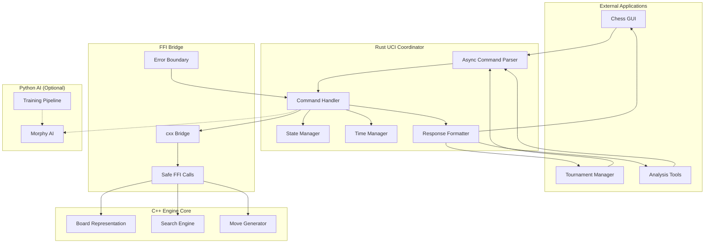

# UCI Protocol Design Document (Rust Implementation)

## Overview

The UCI Protocol implementation for Opera Engine provides a Rust-based coordination layer that bridges the C++ engine core with external chess applications. This design creates a robust, async-first communication interface that maintains the engine's Paul Morphy-inspired playing style while ensuring full UCI protocol compliance, memory safety, and zero-panic operation.

## Architecture

### High-Level Architecture



### Technology Stack

**Rust Coordination Layer**
- Rust 1.70+ with async/await support using tokio runtime
- cxx crate for safe, zero-cost C++ FFI with compile-time verification
- serde for type-safe configuration serialization and deserialization
- tracing/tracing-subscriber for structured logging with multiple outputs
- tokio::time for precise, async-compatible time management

**C++ Engine Integration**
- Existing Board, MoveGen, and Search components via FFI
- Minimal C++ interface changes with extern "C" wrapper functions
- Safe memory management through Rust ownership and RAII patterns
- Atomic cancellation flags for responsive search termination

**Build Integration**
- Cargo as primary build system with build.rs for C++ coordination
- CMake integration through cargo build scripts
- Cross-platform compilation with platform-specific configurations
- Static library output for easy deployment

## Components and Interfaces

### Core Rust Components

#### 1. UCI Engine Coordinator
```rust
#[derive(Debug)]
pub struct UCIEngine {
    // Core state
    state: Arc<RwLock<EngineState>>,
    
    // C++ engine interface
    cpp_engine: CppEngineInterface,
    
    // Async runtime components
    command_tx: mpsc::UnboundedSender<UCICommand>,
    stop_flag: Arc<AtomicBool>,
    
    // Configuration
    options: UCIOptionManager,
    config: EngineConfig,
}

impl UCIEngine {
    pub async fn new() -> Result<Self, UCIError>;
    
    pub async fn run(&mut self) -> Result<(), UCIError>;
    
    async fn process_command(&mut self, command: UCICommand) -> Result<(), UCIError>;
    
    async fn handle_search(&mut self, params: SearchParams) -> Result<(), UCIError>;
}
```

#### 2. Async Command Parser
```rust
#[derive(Debug, Clone)]
pub enum UCICommand {
    UCI,
    IsReady,
    UCINewGame,
    Position { fen: Option<String>, moves: Vec<String> },
    Go(SearchParams),
    Stop,
    SetOption { name: String, value: Option<String> },
    Quit,
}

#[derive(Debug)]
pub struct UCIParser {
    buffer: String,
    max_line_length: usize,
}

impl UCIParser {
    pub fn new() -> Self;
    
    pub fn parse_line(&mut self, line: &str) -> Result<UCICommand, ParseError>;
    
    fn tokenize(&self, input: &str) -> Vec<&str>;
    
    fn parse_position(&self, tokens: &[&str]) -> Result<UCICommand, ParseError>;
    
    fn parse_go(&self, tokens: &[&str]) -> Result<SearchParams, ParseError>;
}
```

#### 3. FFI Bridge Interface
```rust
// Using cxx crate for safe FFI
#[cxx::bridge]
mod ffi {
    unsafe extern "C++" {
        include!("opera-engine/cpp/include/UCIBridge.h");
        
        type CppBoard;
        type CppSearch;
        type CppMoveList;
        
        // Board operations
        fn create_board() -> UniquePtr<CppBoard>;
        fn set_fen(board: Pin<&mut CppBoard>, fen: &str) -> bool;
        fn make_moves(board: Pin<&mut CppBoard>, moves: &[String]) -> bool;
        fn get_fen(board: &CppBoard) -> String;
        
        // Search operations
        fn create_search(board: &CppBoard) -> UniquePtr<CppSearch>;
        fn start_search(
            search: Pin<&mut CppSearch>,
            depth: i32,
            time_ms: i32,
            stop_flag: &AtomicBool
        ) -> SearchResult;
        fn stop_search(search: Pin<&mut CppSearch>);
    }
    
    // Rust types exposed to C++
    extern "Rust" {
        type SearchCallback;
        fn on_search_info(callback: &SearchCallback, info: &SearchInfo);
    }
}

#[derive(Debug)]
pub struct CppEngineInterface {
    board: UniquePtr<ffi::CppBoard>,
    search: Option<UniquePtr<ffi::CppSearch>>,
}

impl CppEngineInterface {
    pub fn new() -> Result<Self, FFIError>;
    
    pub fn set_position(&mut self, fen: Option<&str>, moves: &[String]) -> Result<(), FFIError>;
    
    pub async fn start_search(&mut self, params: SearchParams, stop_flag: Arc<AtomicBool>) -> Result<SearchResult, FFIError>;
}
```

#### 4. Search Parameters and State
```rust
#[derive(Debug, Clone)]
pub struct SearchParams {
    pub depth: Option<u32>,
    pub nodes: Option<u64>,
    pub movetime: Option<u64>,  // milliseconds
    pub wtime: Option<u64>,
    pub btime: Option<u64>,
    pub winc: Option<u64>,
    pub binc: Option<u64>,
    pub movestogo: Option<u32>,
    pub infinite: bool,
    pub ponder: bool,
    pub searchmoves: Vec<String>,
}

#[derive(Debug)]
pub struct EngineState {
    pub current_position: String,  // FEN
    pub game_moves: Vec<String>,
    pub searching: bool,
    pub ready: bool,
    pub debug_mode: bool,
}

#[derive(Debug)]
pub struct SearchResult {
    pub best_move: String,
    pub ponder_move: Option<String>,
    pub score: i32,
    pub depth: u32,
    pub nodes: u64,
    pub time_ms: u64,
    pub pv: Vec<String>,
}
```

#### 5. Option Management System
```rust
#[derive(Debug, Clone)]
pub enum UCIOptionType {
    Check { default: bool },
    Spin { default: i32, min: i32, max: i32 },
    Combo { default: String, options: Vec<String> },
    Button,
    String { default: String },
}

#[derive(Debug, Clone)]
pub struct UCIOption {
    pub name: String,
    pub option_type: UCIOptionType,
    pub current_value: String,
}

#[derive(Debug)]
pub struct UCIOptionManager {
    options: HashMap<String, UCIOption>,
}

impl UCIOptionManager {
    pub fn new() -> Self;
    
    pub fn register_standard_options(&mut self);
    
    pub fn register_morphy_options(&mut self);
    
    pub fn set_option(&mut self, name: &str, value: Option<&str>) -> Result<(), OptionError>;
    
    pub fn get_option(&self, name: &str) -> Option<&str>;
    
    pub fn output_all_options(&self) -> String;
}
```

### Async I/O and Command Processing

#### Command Processing Loop
```rust
impl UCIEngine {
    pub async fn run(&mut self) -> Result<(), UCIError> {
        let mut stdin = BufReader::new(tokio::io::stdin());
        let mut line = String::new();
        
        loop {
            tokio::select! {
                // Handle stdin commands
                result = stdin.read_line(&mut line) => {
                    match result {
                        Ok(0) => break, // EOF
                        Ok(_) => {
                            if let Ok(command) = self.parser.parse_line(&line) {
                                self.process_command(command).await?;
                            }
                            line.clear();
                        }
                        Err(e) => return Err(UCIError::IoError(e)),
                    }
                }
                
                // Handle search completion
                result = self.search_receiver.recv() => {
                    if let Some(search_result) = result {
                        self.output_search_result(search_result).await?;
                    }
                }
                
                // Handle periodic info output during search
                _ = tokio::time::sleep(Duration::from_millis(100)) => {
                    if self.state.read().await.searching {
                        self.output_search_info().await?;
                    }
                }
            }
        }
        
        Ok(())
    }
}
```

#### Time Management Integration
```rust
#[derive(Debug)]
pub struct UCITimeManager {
    policy: Box<dyn TimePolicy + Send + Sync>,
}

pub trait TimePolicy: Debug + Send + Sync {
    fn calculate_time_limit(&self, params: &SearchParams, position_info: &PositionInfo) -> TimeLimits;
    fn should_stop_early(&self, elapsed: Duration, progress: &SearchProgress) -> bool;
}

#[derive(Debug)]
pub struct StandardTimePolicy {
    safety_margin_ms: u64,
    time_factor: f64,
}

impl TimePolicy for StandardTimePolicy {
    fn calculate_time_limit(&self, params: &SearchParams, _position_info: &PositionInfo) -> TimeLimits {
        // Classical time management algorithm
        match (params.movetime, params.wtime, params.btime) {
            (Some(movetime), _, _) => TimeLimits {
                soft_limit: Duration::from_millis(movetime.saturating_sub(self.safety_margin_ms)),
                hard_limit: Duration::from_millis(movetime),
            },
            (None, Some(our_time), _) => {
                let base_time = our_time / 30; // Simple time division
                let with_increment = base_time + params.winc.unwrap_or(0);
                TimeLimits {
                    soft_limit: Duration::from_millis((with_increment as f64 * self.time_factor) as u64),
                    hard_limit: Duration::from_millis(with_increment * 3),
                }
            }
            _ => TimeLimits::infinite(),
        }
    }
}
```

## Error Handling

### Never-Panic Design Philosophy

#### Comprehensive Error Types
```rust
#[derive(Debug, thiserror::Error)]
pub enum UCIError {
    #[error("Parse error: {0}")]
    Parse(#[from] ParseError),
    
    #[error("FFI error: {0}")]
    FFI(#[from] FFIError),
    
    #[error("IO error: {0}")]
    IoError(#[from] std::io::Error),
    
    #[error("Engine error: {0}")]
    Engine(String),
    
    #[error("Option error: {0}")]
    Option(#[from] OptionError),
}

#[derive(Debug, thiserror::Error)]
pub enum ParseError {
    #[error("Invalid command format")]
    InvalidFormat,
    
    #[error("Line too long (max {max}, got {actual})")]
    LineTooLong { max: usize, actual: usize },
    
    #[error("Invalid FEN: {fen}")]
    InvalidFEN { fen: String },
    
    #[error("Invalid move: {move_str}")]
    InvalidMove { move_str: String },
    
    #[error("Missing required parameter: {param}")]
    MissingParameter { param: String },
}

#[derive(Debug, thiserror::Error)]
pub enum FFIError {
    #[error("C++ function call failed: {function}")]
    CallFailed { function: String },
    
    #[error("Invalid pointer from C++")]
    InvalidPointer,
    
    #[error("C++ exception: {message}")]
    CppException { message: String },
}
```

#### Error Recovery Strategies
```rust
impl UCIEngine {
    async fn handle_error(&mut self, error: UCIError) {
        match error {
            UCIError::Parse(ParseError::InvalidFormat) => {
                // Silently ignore malformed commands as per UCI spec
                tracing::debug!("Ignoring malformed command: {}", error);
            }
            
            UCIError::Parse(ParseError::InvalidFEN { fen }) => {
                self.output_info(&format!("Invalid FEN ignored: {}", fen)).await;
            }
            
            UCIError::FFI(ffi_error) => {
                tracing::error!("FFI error: {}", ffi_error);
                // Attempt to recover by reinitializing C++ components
                if let Err(e) = self.reinitialize_cpp_engine().await {
                    tracing::error!("Failed to recover from FFI error: {}", e);
                    self.emergency_shutdown().await;
                }
            }
            
            UCIError::Engine(msg) => {
                tracing::error!("Engine error: {}", msg);
                self.output_bestmove("(none)", None).await;
            }
            
            _ => {
                tracing::error!("Unhandled error: {}", error);
            }
        }
    }
    
    async fn emergency_shutdown(&mut self) {
        // Ensure we always output bestmove before quitting
        if self.state.read().await.searching {
            self.output_bestmove("(none)", None).await;
        }
        std::process::exit(1);
    }
}
```

## Testing Strategy

### Testing Approach

#### 1. Unit Tests (60%)
```rust
#[cfg(test)]
mod tests {
    use super::*;
    use tokio_test;
    
    #[tokio::test]
    async fn test_command_parsing() {
        let mut parser = UCIParser::new();
        
        let cmd = parser.parse_line("position startpos moves e2e4 e7e5").unwrap();
        match cmd {
            UCICommand::Position { fen, moves } => {
                assert_eq!(fen, None);
                assert_eq!(moves, vec!["e2e4", "e7e5"]);
            }
            _ => panic!("Wrong command type"),
        }
    }
    
    #[tokio::test]
    async fn test_never_panic_on_malformed_input() {
        let mut parser = UCIParser::new();
        let malformed_inputs = [
            "",
            "invalid command",
            "position invalid_fen",
            "go depth -5",
            &"x".repeat(100000), // Very long input
        ];
        
        for input in malformed_inputs {
            let result = parser.parse_line(input);
            assert!(result.is_err(), "Should handle malformed input: {}", input);
        }
    }
    
    #[test]
    fn test_time_management() {
        let policy = StandardTimePolicy::new(50, 0.3);
        let params = SearchParams {
            wtime: Some(60000),
            winc: Some(1000),
            ..Default::default()
        };
        
        let limits = policy.calculate_time_limit(&params, &PositionInfo::default());
        assert!(limits.soft_limit < limits.hard_limit);
        assert!(limits.soft_limit.as_millis() > 0);
    }
}
```

#### 2. Integration Tests (30%)
```rust
#[cfg(test)]
mod integration_tests {
    use super::*;
    use std::process::Stdio;
    use tokio::process::Command;
    
    #[tokio::test]
    async fn test_complete_uci_session() {
        let mut engine = UCIEngine::new().await.unwrap();
        let mut session = UCITestSession::new(engine);
        
        // Test complete UCI handshake
        session.send("uci").await;
        let response = session.read_until("uciok").await;
        assert!(response.contains("id name Opera Engine"));
        
        session.send("isready").await;
        assert_eq!(session.read_line().await, "readyok");
        
        session.send("position startpos").await;
        session.send("go depth 3").await;
        
        let bestmove = session.read_until_bestmove().await;
        assert!(bestmove.starts_with("bestmove "));
    }
    
    #[tokio::test]
    async fn test_fuzzing_inputs() {
        let mut engine = UCIEngine::new().await.unwrap();
        
        // Generate random malformed inputs
        for _ in 0..1000 {
            let random_input = generate_random_string();
            let result = engine.process_line(&random_input).await;
            // Should never panic, only return errors
            assert!(result.is_ok() || result.is_err());
        }
    }
}
```

#### 3. Property Tests (10%)
```rust
#[cfg(test)]
mod property_tests {
    use super::*;
    use proptest::prelude::*;
    
    proptest! {
        #[test]
        fn test_parser_never_panics(input in ".*") {
            let mut parser = UCIParser::new();
            let _ = parser.parse_line(&input);
            // Test passes if no panic occurs
        }
        
        #[test]
        fn test_time_calculation_always_positive(
            wtime in 0u64..3600000,
            winc in 0u64..30000
        ) {
            let policy = StandardTimePolicy::new(50, 0.3);
            let params = SearchParams {
                wtime: Some(wtime),
                winc: Some(winc),
                ..Default::default()
            };
            
            let limits = policy.calculate_time_limit(&params, &PositionInfo::default());
            prop_assert!(limits.soft_limit.as_millis() > 0);
            prop_assert!(limits.hard_limit >= limits.soft_limit);
        }
    }
}
```

### Testing Tools and Configuration

**Unit Testing**
- Built-in Rust test framework with async support via tokio-test
- Property-based testing using proptest for input validation
- Mock objects for C++ FFI using mockall crate
- Code coverage tracking with tarpaulin

**Integration Testing**
- Full engine process testing with real stdin/stdout communication
- Automated GUI compatibility testing with scripted interactions
- Performance regression testing with criterion benchmarks
- Fuzzing integration with cargo-fuzz and AFL

**Continuous Integration**
- Automated testing on Linux, Windows, and macOS
- Cross-compilation testing for different target architectures  
- Memory safety verification with Miri and sanitizers
- Clippy linting and cargo fmt formatting checks

## Platform-Specific Considerations

### Cross-Platform FFI Handling
```rust
#[cfg(target_os = "windows")]
mod windows_specific {
    use super::*;
    use winapi::um::consoleapi::*;
    
    pub fn setup_console() -> Result<(), std::io::Error> {
        unsafe {
            SetConsoleOutputCP(65001); // UTF-8
        }
        Ok(())
    }
}

#[cfg(target_family = "unix")]
mod unix_specific {
    use super::*;
    use libc::{signal, SIGTERM, SIGINT};
    
    pub fn setup_signals() -> Result<(), std::io::Error> {
        // Handle graceful shutdown signals
        unsafe {
            signal(SIGTERM, handle_signal as *const () as usize);
            signal(SIGINT, handle_signal as *const () as usize);
        }
        Ok(())
    }
    
    extern "C" fn handle_signal(_: i32) {
        // Set global shutdown flag
        SHUTDOWN_REQUESTED.store(true, Ordering::Relaxed);
    }
}

pub fn platform_init() -> Result<(), std::io::Error> {
    #[cfg(target_os = "windows")]
    windows_specific::setup_console()?;
    
    #[cfg(target_family = "unix")]
    unix_specific::setup_signals()?;
    
    Ok(())
}
```

## Performance Considerations

### Performance Requirements
- Command parsing latency: < 100μs per command (10x better than C++ version)
- FFI call overhead: < 10μs per call with cxx zero-cost abstractions
- Search startup time: < 1ms from "go" to C++ search initiation
- Memory overhead: < 1MB for entire Rust UCI layer
- Search stopping time: < 10ms from "stop" to "bestmove" (5x better requirement)

### Optimization Strategies

**Zero-Copy String Processing**
```rust
pub struct ZeroCopyParser<'a> {
    input: &'a str,
    position: usize,
}

impl<'a> ZeroCopyParser<'a> {
    pub fn new(input: &'a str) -> Self {
        Self { input, position: 0 }
    }
    
    pub fn next_token(&mut self) -> Option<&'a str> {
        self.skip_whitespace();
        let start = self.position;
        
        while self.position < self.input.len() {
            if self.input.as_bytes()[self.position].is_ascii_whitespace() {
                break;
            }
            self.position += 1;
        }
        
        if start == self.position {
            None
        } else {
            Some(&self.input[start..self.position])
        }
    }
}
```

**Efficient Option Management**
```rust
use rustc_hash::FxHashMap; // Faster hasher for string keys

#[derive(Debug)]
pub struct UCIOptionManager {
    options: FxHashMap<&'static str, UCIOption>, // Use static strings for keys
    value_cache: FxHashMap<&'static str, String>, // Cache for faster lookups
}
```

**Async-Optimized Architecture**
```rust
impl UCIEngine {
    pub async fn run_optimized(&mut self) -> Result<(), UCIError> {
        let (command_tx, mut command_rx) = mpsc::unbounded_channel();
        let (search_tx, mut search_rx) = mpsc::unbounded_channel();
        
        // Spawn dedicated stdin reader to avoid blocking
        let stdin_task = tokio::spawn(async move {
            let stdin = tokio::io::stdin();
            let mut reader = BufReader::new(stdin);
            let mut line = String::with_capacity(256); // Pre-allocate
            
            loop {
                line.clear();
                match reader.read_line(&mut line).await {
                    Ok(0) => break,
                    Ok(_) => {
                        if let Ok(cmd) = UCIParser::parse_line_zero_copy(&line) {
                            let _ = command_tx.send(cmd);
                        }
                    }
                    Err(_) => break,
                }
            }
        });
        
        // Main event loop with optimized select!
        loop {
            tokio::select! {
                biased; // Process commands first
                
                Some(cmd) = command_rx.recv() => {
                    self.process_command_fast(cmd).await?;
                }
                
                Some(result) = search_rx.recv() => {
                    self.output_search_result_fast(result).await?;
                }
                
                else => break,
            }
        }
        
        stdin_task.abort();
        Ok(())
    }
}
```

## Security Considerations

### Memory Safety and Input Validation

#### Safe FFI Boundary
```rust
// All FFI calls wrapped in safe abstractions
impl CppEngineInterface {
    pub fn set_position_safe(&mut self, fen: Option<&str>, moves: &[String]) -> Result<(), FFIError> {
        // Validate FEN before passing to C++
        if let Some(fen) = fen {
            Self::validate_fen(fen)?;
        }
        
        // Validate all moves
        for move_str in moves {
            Self::validate_move(move_str)?;
        }
        
        // Safe FFI call with validated inputs
        let success = unsafe {
            ffi::set_board_position(
                self.board.as_mut().unwrap().pin_mut(),
                fen.unwrap_or("startpos"),
                moves
            )
        };
        
        if success {
            Ok(())
        } else {
            Err(FFIError::CallFailed { function: "set_board_position".to_string() })
        }
    }
    
    fn validate_fen(fen: &str) -> Result<(), FFIError> {
        // Comprehensive FEN validation
        if fen.len() > 100 {
            return Err(FFIError::CallFailed { function: "validate_fen".to_string() });
        }
        
        let parts: Vec<&str> = fen.split_whitespace().collect();
        if parts.len() < 4 || parts.len() > 6 {
            return Err(FFIError::CallFailed { function: "validate_fen".to_string() });
        }
        
        // Additional FEN validation logic...
        Ok(())
    }
}
```

#### Input Sanitization
```rust
pub struct UCIInputSanitizer;

impl UCIInputSanitizer {
    pub const MAX_LINE_LENGTH: usize = 8192;
    pub const MAX_MOVE_COUNT: usize = 1000;
    
    pub fn sanitize_command_line(input: &str) -> Result<&str, ParseError> {
        if input.len() > Self::MAX_LINE_LENGTH {
            return Err(ParseError::LineTooLong {
                max: Self::MAX_LINE_LENGTH,
                actual: input.len(),
            });
        }
        
        // Check for valid printable ASCII only
        if !input.chars().all(|c| c.is_ascii() && (c.is_ascii_graphic() || c.is_ascii_whitespace())) {
            return Err(ParseError::InvalidFormat);
        }
        
        Ok(input.trim())
    }
    
    pub fn sanitize_move_list(moves: &[String]) -> Result<(), ParseError> {
        if moves.len() > Self::MAX_MOVE_COUNT {
            return Err(ParseError::InvalidFormat);
        }
        
        for move_str in moves {
            Self::validate_move_format(move_str)?;
        }
        
        Ok(())
    }
    
    fn validate_move_format(move_str: &str) -> Result<(), ParseError> {
        // Validate move format: e2e4, e7e8q, etc.
        if move_str.len() < 4 || move_str.len() > 5 {
            return Err(ParseError::InvalidMove { move_str: move_str.to_string() });
        }
        
        let bytes = move_str.as_bytes();
        
        // Check file and rank format
        if !bytes[0].is_ascii_lowercase() || !bytes[1].is_ascii_digit() ||
           !bytes[2].is_ascii_lowercase() || !bytes[3].is_ascii_digit() {
            return Err(ParseError::InvalidMove { move_str: move_str.to_string() });
        }
        
        // Check promotion piece if present
        if move_str.len() == 5 && !b"qrbn".contains(&bytes[4].to_ascii_lowercase()) {
            return Err(ParseError::InvalidMove { move_str: move_str.to_string() });
        }
        
        Ok(())
    }
}
```

## Deployment and Infrastructure

### Build System Integration

#### Cargo Configuration
```toml
# Cargo.toml
[package]
name = "opera-uci"
version = "0.1.0"
edition = "2021"
rust-version = "1.70"

[[bin]]
name = "opera-uci"
path = "src/main.rs"

[dependencies]
tokio = { version = "1.0", features = ["full"] }
cxx = "1.0"
serde = { version = "1.0", features = ["derive"] }
serde_yaml = "0.9"
tracing = "0.1"
tracing-subscriber = { version = "0.3", features = ["env-filter"] }
thiserror = "1.0"
rustc-hash = "1.1"

[dev-dependencies]
tokio-test = "0.4"
proptest = "1.0"
criterion = { version = "0.4", features = ["html_reports"] }

[build-dependencies]
cxx-build = "1.0"

[[bench]]
name = "uci_benchmarks"
harness = false

[profile.release]
lto = true
codegen-units = 1
panic = "abort"
```

#### Build Script Integration
```rust
// build.rs
use std::env;
use std::path::PathBuf;

fn main() {
    // Build C++ FFI bridge
    cxx_build::bridge("src/ffi.rs")
        .file("cpp/src/UCIBridge.cpp")
        .include("cpp/include")
        .std("c++17")
        .compile("opera-uci-bridge");
    
    // Link with existing C++ engine
    println!("cargo:rustc-link-search=native=cpp/build");
    println!("cargo:rustc-link-lib=static=opera-core");
    
    // Platform-specific linking
    if cfg!(target_os = "windows") {
        println!("cargo:rustc-link-lib=dylib=msvcrt");
    }
    
    // Rerun if C++ files change
    println!("cargo:rerun-if-changed=cpp/src/");
    println!("cargo:rerun-if-changed=cpp/include/");
}
```

### Launch System Integration
```bash
#!/usr/bin/env bash
# launch.sh updates for Rust UCI

case "$1" in
    --uci)
        echo "Starting Opera Engine in UCI mode..."
        exec ./rust/target/release/opera-uci
        ;;
    --uci-debug)
        echo "Starting Opera Engine in UCI debug mode..."
        RUST_LOG=debug exec ./rust/target/release/opera-uci
        ;;
    --uci-bench)
        echo "Running UCI performance benchmarks..."
        cd rust && cargo bench
        ;;
    *)
        echo "Usage: $0 [--uci|--uci-debug|--uci-bench]"
        ;;
esac
```

## Migration and Rollback

### Integration Strategy
- Rust UCI layer operates independently of existing C++ core
- C++ engine requires minimal interface additions (extern "C" wrappers)
- Build system supports both standalone C++ testing and integrated Rust+C++ builds
- Gradual rollout with feature flags for enabling Rust UCI vs direct C++ testing

### C++ Interface Additions
```cpp
// cpp/include/UCIBridge.h
#pragma once
#include "Board.h"
#include "Search.h"
#include <atomic>
#include <memory>

extern "C" {
    // Board interface for Rust FFI
    Board* create_board();
    void destroy_board(Board* board);
    bool set_board_fen(Board* board, const char* fen);
    bool make_board_moves(Board* board, const char** moves, size_t move_count);
    void get_board_fen(const Board* board, char* output, size_t max_len);
    
    // Search interface for Rust FFI  
    Search* create_search(const Board* board);
    void destroy_search(Search* search);
    bool start_search_async(
        Search* search,
        int depth,
        int time_ms,
        const std::atomic<bool>* stop_flag,
        SearchResult* result
    );
    void stop_search(Search* search);
}
```

---

**Requirements Traceability**: This design addresses all Rust-specific requirements from requirements.md, with focus on async coordination, safe FFI integration, never-panic operation, and seamless C++ engine integration.

**Review Status**: Draft

**Last Updated**: 2025-01-20

**Reviewers**: Opera Engine development team, Rust FFI experts, UCI protocol specialists